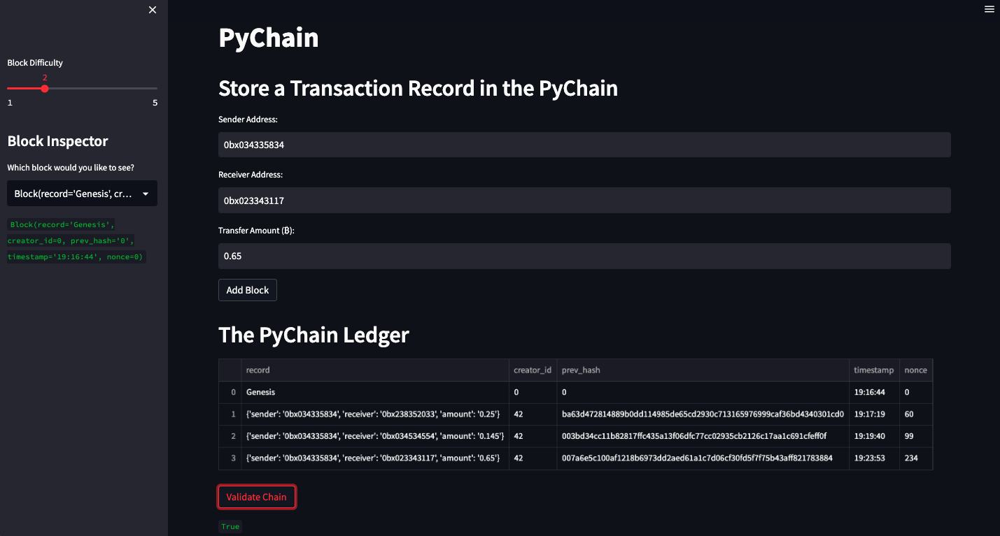

# Module-18-Challenge
## Blockchain-Based Ledger System

---

 

### <u>Overview of the Analysis</u>

 

### <b>Purpose:</b>

The purpose of this software was to simulate the development of a blockchain-based ledger system for a bank's decentralized finance team. The program is to include a user-friendly web interface in order to aid in the facilitation of tokens between blockchain-based financial transactions from sender-to-receivers, and vice versa. Additionally, there is a 'true/false' verification method built into the algorithm to assist in confirmation of the ledger's validity.

Modifications to the original boilerplate Pychain ledger structure were completed in order to achieve receiver/sender functionality. These modifications are outlined below: 

### <b>Process & Variables:</b>

 

#### <b>Instruction Overview</b>

Enhancements to the PyChain (pychain.py) boilerplate code are outlined through these process steps. The pychain.py code already includes functionality to create blocks, perform the proof-of-work consensus protocol, as well as validate blocks in the chain. 

The steps for this assignment are divided into the following sections:
1. Create a Record Data Class
2. Modify the Existing Block Data Class to Store Record Data
3. Add Relevant User Inputs to the Streamlit Interface
4. Test the PyChain Ledger by Storing Records

 

#### 1.) <u>Create a 'Record' Data Class:</u>

 
  i.) A new Python data class named 'Record' is instantiated with a @dataclass decorator & constructor attribute variables including 'sender' (str), 'receiver' (str), & 'amount' (float).
  This Record class will replace the generic 'data' type with a 'record' attribute (creation of class Record obj) in the next part.
 
 

#### 2.) <u>Modification of the Existing Block Data Class to Store Record Data: </u>

  
  i.) The generic 'data' attribute in the 'Block' class is renamed to 'record' and set to the type instance of 'Record' class, that was newly added above. 
 
 

#### 3.) <u>Add Relevant User Inputs to the Streamlit Interface: </u>

New input areas were then coded into the interface of the Streamlit application. These inputs were utilized to handle the sender, receiver, & amount for each transaction to be stored in the 'Block' data class. This is accomplished with the following steps.

 
    i.) The original 'input_data' variable is discarded. 
    ii.) An input area where you can get a value for 'sender' from the user is added.
    iii.) An input area where you can get a value for 'receiver' from the user is added.
    iv.) An input area where you can get a value for 'amount' from the user is added.
    v.) The 'Add Block' functionality is modified whereby the 'new_block' obj's attribute updates & creates a new 'Block' that has an attribute of new 'Record' called 'record' that includes the variables 'sender', 'receiver', & 'amount' values. The 'Block' still also includes the 'creator_id' & 'prev_hash' attributes as well. 
 
 

#### 4.) <u>Test the PyChain Ledger by Storing Records: </u>

Testing of the newly modified 'PyChain' ledger program is accomplished by running the Streamlit App & storing some test mined blocks within the new 'PyChain' ledger. Afterwards, the blockchain can be validated using the 'Validate Chain' button that runs the '.is_valid()' method to confirm via true/false boolean that it is indeed a validate ledger.

 
    i.) Using terminal, navigate to project folder where pychain.py is located.
    ii.) Run the Streamlit App by running the 'streamlit run pychain.py' command.
    iii.) Enter values for sender/receiver test wallets & an amount* to be sent. (*Note: The amount value is designated in Bitcoin(₿) for familiarity sake).
    iv.) Verify the block contents & hashes in the Streamlit App.
    v.) Record screenshots & evidence that the app is running correctly.
 
 

### <u>Results</u>

- <u> PyChain (Streamlit Ledger Application):</u>

  

  
  

  The figure above illustrates the working PyChain (Streamlit Ledger Application) with 3 verifiable working sender/receiver transactions as well as the Genesis Block, as summarized in the Pandas DataFrame table. The Block Difficulty was set to '2' using the slider bar for simplicity sake and to reduce the nonce value, and hence, the proof of work computation time. At the bottom of the displayed application is the 'Validate Chain' button which has been activate (pressed) in order to display the resulting 'True' statement. This is confirmation the chain is indeed a valid one.

   
   

### <u>Summary</u>

Therefore, the modifications to the existing PyChain are successful in displaying the corresponding sender/receiver wallet pairing and their associated transfer amounts. The PyChain wallet also correctly displays the applicable 'creator_id', 'prev_hash', 'timestamp' and 'nonce (linearly relationship to PoW difficulty level) within the Pandas Dataframe transaction summary table. 
